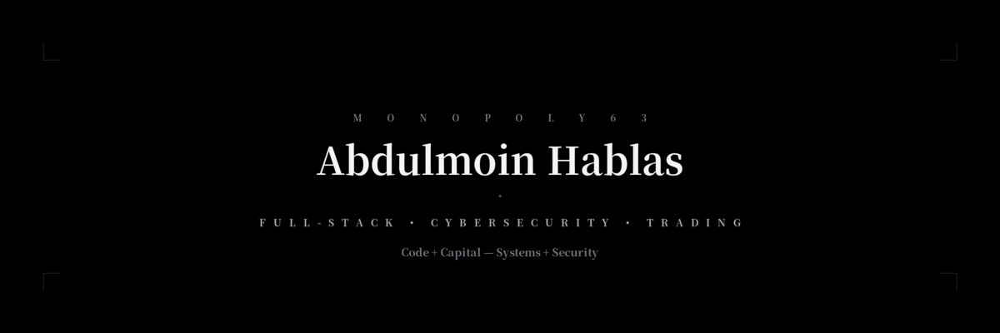

  
    
  
  
  
  
  

---

### About

**Abdulmoin Hablas — Monopoly63**  
Full-Stack Engineer • Cybersecurity • Trading Systems

A versatile technologist bridging code and capital. I build robust systems, secure digital infrastructures, and intelligent trading tools.

- 🔭 Building: **Hablas CLI — Multi-agent AI dev tool**
- 🌱 Focus: System Design, Security, Algorithmic Trading
- 💬 Ask me about: React/Next.js, Python/FastAPI, Pentesting, Trading bots
- ⚡ I code best at 2 AM with a cup of coffee

---

### Stack

  

<code>TypeScript</code> <code>Python</code> <code>Go</code> <code>React</code> <code>Next.js</code> <code>Node.js</code> <code>FastAPI</code> <code>PostgreSQL</code> <code>MongoDB</code> <code>Docker</code>

<b>Cybersecurity:</b> Pentesting • OSINT • Vuln Assessment • CTF • Linux Security 
<b>Trading:</b> Technical Analysis • Algorithmic Trading • Risk Management 
<b>Automation:</b> API Integration • Web Scraping • Pipeline Deployment

---

### Stats

  
  

  

  

---

### Featured

<table>
<tr>
<td width="50%" valign="top">

<b>▲ Trade Tracker</b> 
Professional trading journal & risk analysis. Statistical engine, performance tracking.  
<code>Next.js</code> <code>TS</code> 
<a href="https://trade-tracker-monopoly63s-projects.vercel.app/">Live →</a> · <a href="https://github.com/Monopoly63">Code</a>

</td>
<td width="50%" valign="top">

<b>◆ Tree Algorithms Lab</b> 
Interactive lab for advanced tree algorithms. Visualize traversals, m-ary → BT → BST.  
<code>Python</code> <code>FastAPI</code> 
<a href="https://tree-algorithms-lab.vercel.app/">Live →</a> · <a href="https://github.com/Monopoly63">Code</a>

</td>
</tr>
<tr>
<td width="50%" valign="top">

<b>◇ AI Search Engine</b> 
AI-powered search with intelligent, context-aware results. Natural language UX.  
<code>Next.js</code> <code>AI</code> 
<a href="https://ai-search-engine-ashy.vercel.app/">Live →</a> · <a href="https://github.com/Monopoly63">Code</a>

</td>
<td width="50%" valign="top">

<b>⬢ Hablas CLI</b> 
Multi-agent CLI dev tool. Plans, architects, codes, reviews, deploys autonomously.  
<code>Python</code> <code>AI Agents</code> 
SOON · <a href="https://github.com/Monopoly63">Code</a>

</td>
</tr>
</table>

---

  © 2026 Abdulmoin Hablas • Monopoly63 
  

